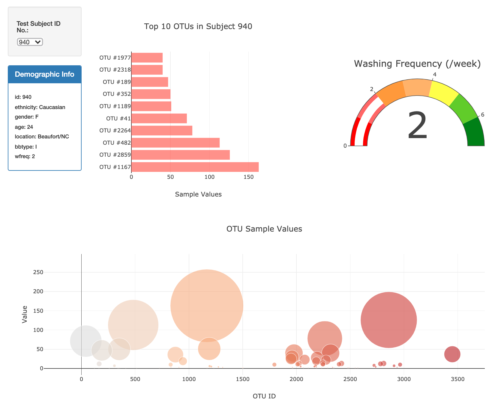

# biodiversity-dashboard

Dashboard that explores navel sample data and displays the results for each subject in a barchart and bubble plot. 

D3 allows the site to automatically populate the charts based on the selected dropdown menu containing Subject IDs and populates the demographics panel. The top 10 OTUs are displayed in the barchart, sorted by OTU ID and sample value and the entire OTU sample can be viewed in the bubble chart.  

[View the dashboard.](https://mvhaynes.github.io/biodiversity-dashboard)

## Tools 
* Javascript, D3, Plotly 

## data 
[Sample data](https://github.com/Mvhaynes/biodiversity-dashboard/blob/main/data/samples.json) obtained from
Hulcr, J. et al.(2012) A Jungle in There: Bacteria in Belly Buttons are Highly Diverse http://robdunnlab.com/projects/belly-button-biodiversity/results-and-data/
